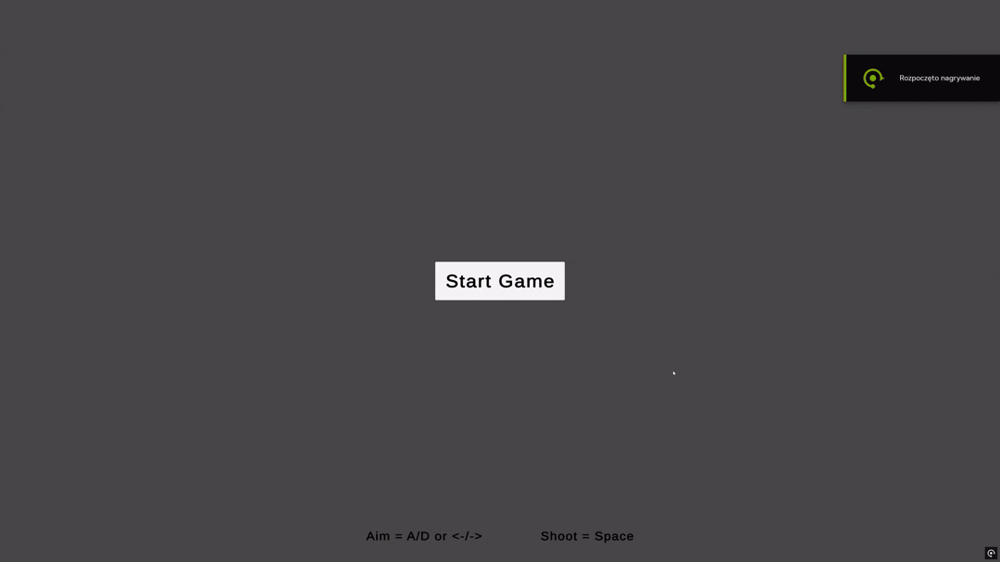
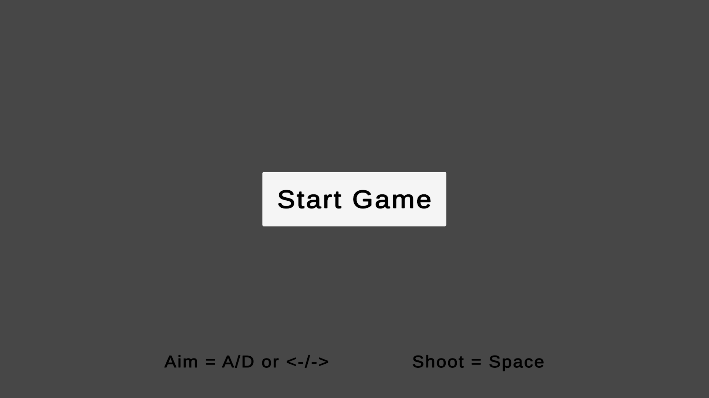
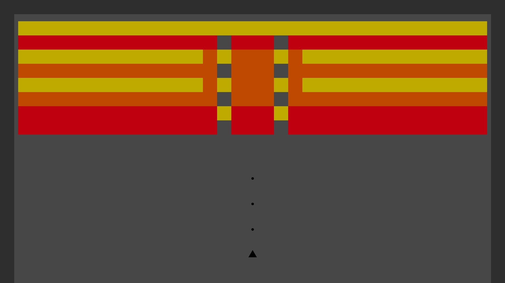

# Brick n Balls
Simple Game using Unity ECS

## Description:
Players shoot balls to break bricks with limited ammo, earn points, and try to clear as many bricks as possible. 
UI is separated into a dedicated scene using TextMeshPro, while all gameplay entities are handled via ECS. 
Supports New Input System, URP, and IL2CPP with maximum optimization.

## Gameplay:

## What I’m Learning:
1. Implementing physics-based gameplay using Unity ECS and Unity Physics
2. Handling input and game mechanics with the new Input System
3. Structuring a game with multiple scenes and UI managed separately from gameplay
4. Managing score, game state, and limited resources in an ECS-driven environment
5. Integrating 3D physics with 2D visuals for a hybrid presentation layer
